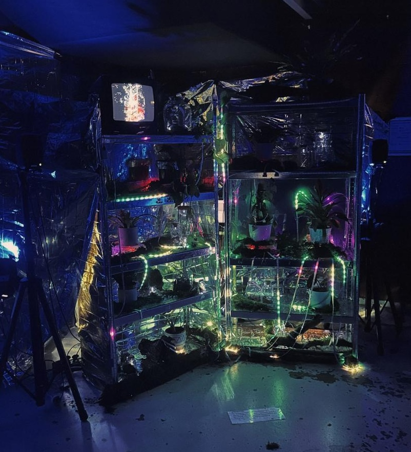
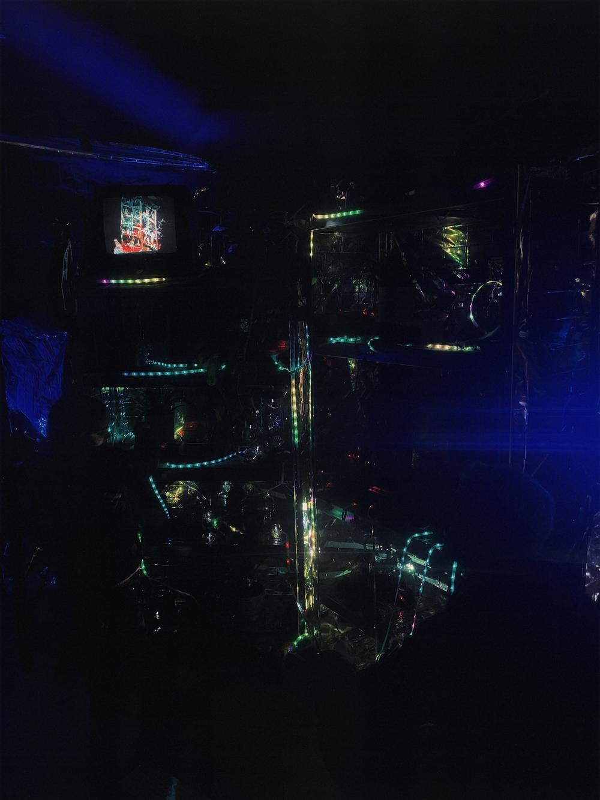
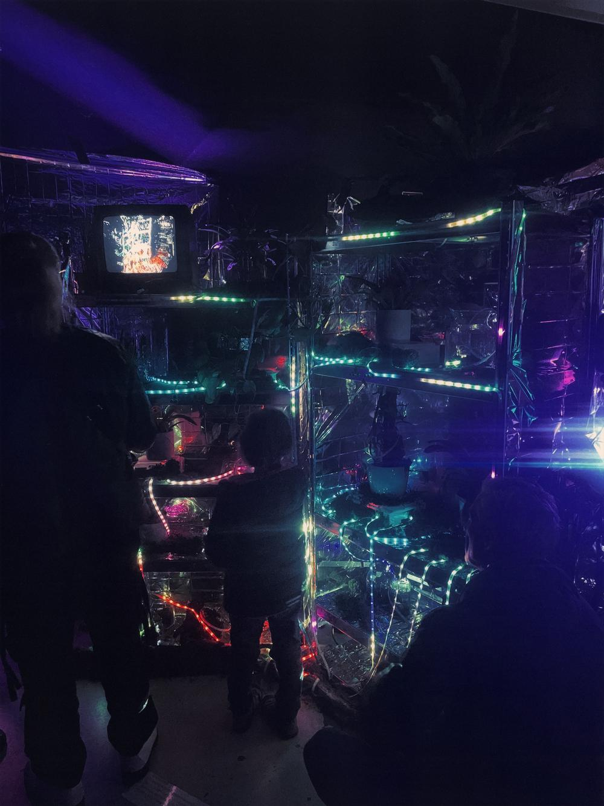
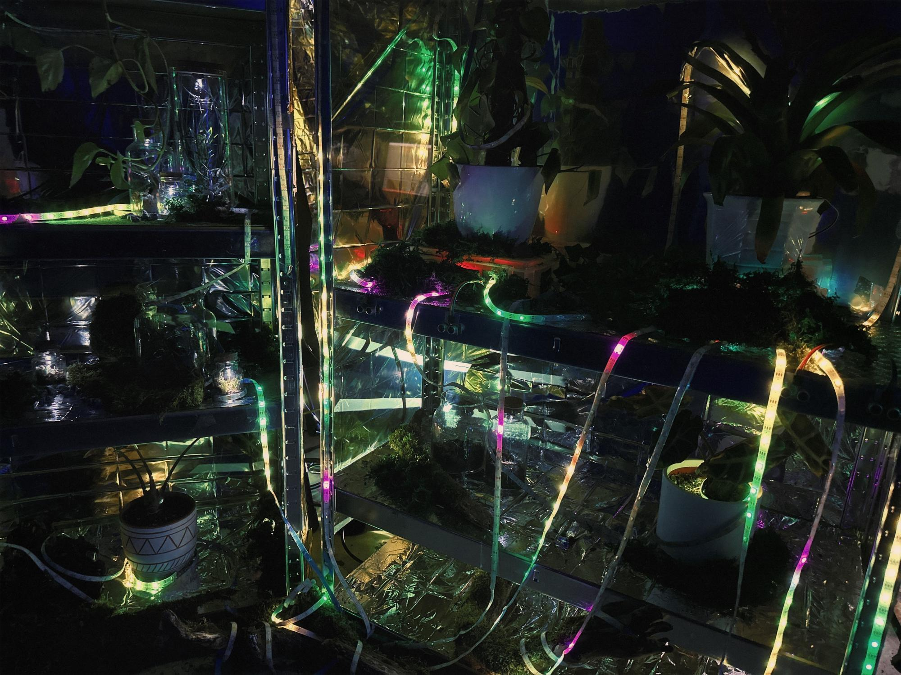

+++
title = "EpiphBytes"
draft = false
showMetadata =  false
date = "2024-03-07"
tags = ["installation", "plants", "interaction", "networking"]
category = ["finished"]
[params]
photocredit = "Andreea Mircea"
+++

EpiphBytes is an interactive installation contemplating our relationship with nature and our impact on ecosystems.

The server rack-looking structure houses several live plants, their LED-roots hanging like liana, glowing green-ish. The plants are thriving, collecting nutrients (pink LEDs) and delivering them to the plants.

If people approach, the roots tint towards blue. We know plants are aware of their surroundings and humans nearby.

If people touch the plants the roots star to wither, turning yellow-orange. Is the touch released the plant will recover after a short while.

If the touch persists the roots turn bloog red, the ambient sound plays a glitched shutdown piece, after which the roots turn off completely. The plant is dead.

Regeneration will take a long time, but is possible without human intervention.

This was a collaborative project with many people involved, see [the project's team page](https://epiphbytes-project.cargo.site/team-1).

My part was overseeing the technical side of things. Setting up a local wifi as communication layer, a nodeJS-OSC server for message routing and passing and prototyping ESP32 micro-controllers measuring distance and touch and LED controls. OSC messages are forwarded to Ableton for interactive sound, TouchDesigner controlling the point cloud on the small CRT-TV and the lights illuminating the backdrop.

See more on [the project's website](https://epiphbytes-project.cargo.site/) (also contains a video! It's good, watch it).

