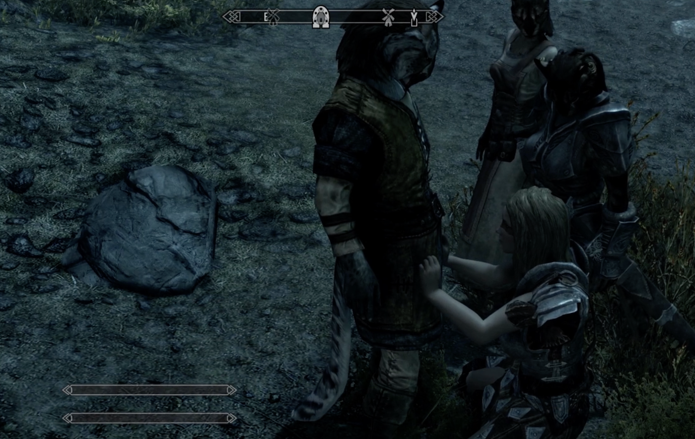
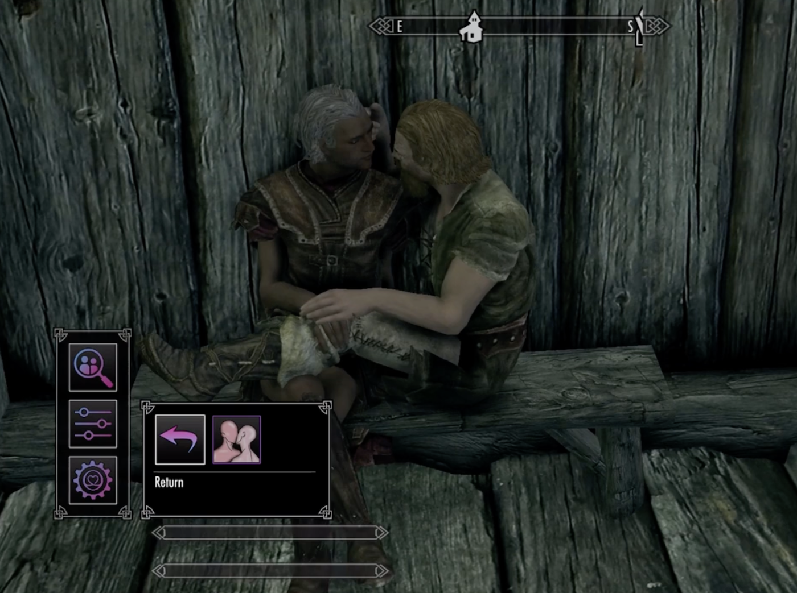
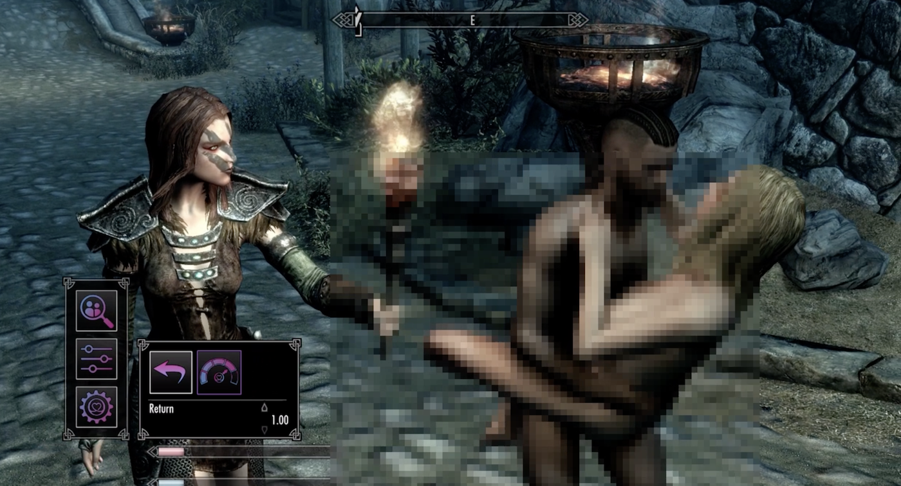
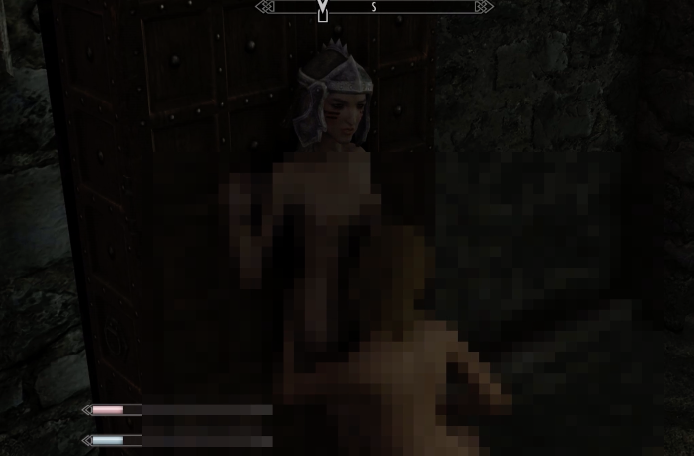

+++
title = "I think about porn sometimes"
draft = false
showMetadata =  false
date = "2024-09-30"
tags = ["machinima", "porn", "modding"]
category = ["finished"]
+++

In this project I explored the practice of [machinima](https://en.wikipedia.org/wiki/Machinima): creating film with content obtained through game play or game engines.

I specifically wanted to look at modding (writing custom content for (mostly) commercial games) and explicitly sexual or pornografic content.

The game of choice here is the open world, action-role-playing game [Skyrim](https://store.steampowered.com/agecheck/app/489830/), because of its very widespread and active porn-modding scene that even allowed for some pretty queer sex.

Overall, the idea is that I walk around Skyrim as both a male and female character and use a sex mod to have sex with lots of NPCs while contemplating the hypocrisy of porn as both shunned and also sought-after content in various forms of media.

The outcome is very explicit so I blurred it quite a bit which also has a certain aesthetic to it. You won't find it on any platform, meaning you can write me an email to ask for a download link :D

I have some thoughts on maybe doing a remake of this and including more footage from the actual modding process and the forums where people discuss the mods (soooo interesting!)

If you're also interested in this, also get in touch!

    I leave you with the transcript of the text and some stills.


``` text

# I think about porn sometimes

When I think about porn sometimes, I think about the hypocrisy around it and how it is such a
fascinating aspect of our culture.

Sex is one of the most natural pastimes besides eating and sleeping. Yet patriarchal structures
managed to mold the depiction of sex and the enjoyment of said depiction, into another tool of
oppression. Effectively converting porn into something so shameful that it has to be hidden away
from the public.

Except porn is still everywhere. All the time. Just not explicitly.
When I think about porn sometimes, I think about how different media deal with sexual content. For
mainstream film and literature it's accepted to depict sex within certain boundaries. To add some
spice, just not too much! Too much and it becomes porn and nobody wants that! Except everyone
kind of does. Truly explicit sexual content for consumption and exploration dwells in the outskirts,
the porn sections. But there it thrives.

Only popular music seems to have achieved talking explicitly about sex without repercussions.
Some lyrics describe sexual acts in such detail that even I think “Damn”, and I think about porn
quite a bit. Yet there is no porn music genre. I wonder how they did that.
When I think about porn in media, I think about porn in video games sometimes.

Sex in video games is, when it happens, kind of awkward. Video games are THE interactive
medium, but how do you design mechanics and controls for interaction for something so very
personal? If you design badly it’s ridiculous, if you design it well, you probably made a porn game!
And nobody wants that! Except, maybe they do?

When I think about porn sometimes, I think about how creative people get about it. Porn is very
individual and the industries in the outskirts of the public can’t satisfy all the niches. So of course
people create their own! They write novels worth of fan fiction and publish it for free. They film
amateur porn and upload it for the world to watch. They program sex mods for video games and
make tutorials on how to use them, so that everyone can play out their own virtual scene. It creates
a sense of community that’s kind of liberating, because here, everybody is a pervert.

When I think about porn sometimes, I think about how, even in sex mods for a game like Skyrim, I
encounter patriarchal structures. It’s in the four mods I need to install to find a gender configuration
I like. It’s in how I need to load custom textures to add body hair to female associated models. It’s
in the impossibility to use the body slider mod to make a fat or even just a chubby person. It’s in the
hard coded code where the sex scene ends when the male associated participant orgasms.

If we talked more about porn, accepted it as something people use for inspiration and creative outlet
and pleasure, maybe we could move it a little closer to the public. Find the aspects that can be
freeing and share them. Call out the problematic ones and improve or replace them. And slowly but
surely, dismantle the tools of oppression.

```








